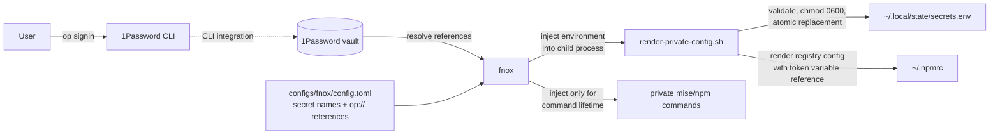

# dotfiles

macOS dotfiles based entirely on the incredible [mise](https://mise.jdx.dev/) as the control plane
and **Git as the source of truth**.

## Design principles

1. **From zero to everything in one shot** - apps, configs, brews and MacOS tweaks
1. **One convergent control plane** - the common state lives in `mise.toml`. `mise run sync` handles
   everything
1. **Git is synchronization** - laptops converge by pulling and pushing this repository.
1. **Idempotent retries** - rerun mise tasks as needed; only missing or changed state is applied.
1. **Edit live** - managed configs are symlinked from `$HOME` into the repository
1. **No secrets in Git** — sensitive values come from 1Password/fnox integration and kept out of
   source

## Normal everyday use

```bash
cd "$HOME/dotfiles"
git pull --rebase
mise run sync
```

Thats it! Any changes in the mise targets will be applied whether it be config updates, brews/casks,
MacOS settings. Changes are persisted and propagated between machines with every day git commands
against the repo.

## Adding new apps, configs etc

- **Tracked files (traditional dotfiles / configs)**: Edit as normal, commit.
- **Apps (brews, casks, mas, etc)**: Add to the mise toml or use the mise CLI commands, commit
- **MacOS settings**: Also in the mise.toml, commit
- **Track new files**: Also in the mise-toml (or use mise CLI), commit

## New machine bootstrap

On a clean Mac, run the repository-root wrapper:

```sh
curl -fsSL https://raw.githubusercontent.com/erzz/dotfiles/main/bootstrap.sh | bash
```

It verifies macOS and Apple's Command Line Tools, acquires the repository at `$HOME/dotfiles` path
(use `BOOTSTRAP_BRANCH=<branch>` when testing a branch), ensures Homebrew and mise are installed,
then runs the pre-auth `prepare` task and stops for the unavoidable manual steps.

### Unavoidable, one-time, manual steps

These one-time manual interventions are documented by the `prepare` task's output, but for clarity
they are and cannot be avoided:

1. Sign into the App Store using your Apple ID (for later installation of apps via mas)
2. Authenticate yourself with github using the `gh auth login` command
3. Log into 1password and enable CLI (under developer settins)
4. run `op signin` to authenticate the CLI

Now you are ready and can run the following at any time:

## Keeping laptops in sync

Git is the synchronization mechanism; `mise run sync` applies only the checked-out repository.
Authenticate every laptop separately. On a laptop receiving changes, use:

```bash
cd "$HOME/dotfiles"
git pull --rebase
mise run sync
```

## Private credentials

`mise run render-private-config` (included in the sync task) runs the fnox/1Password-backed renderer
and owns the regular files `~/.local/state/secrets.env` and `~/.npmrc`. It validates required values
before writing, uses mode `0600`, and atomically replaces the files with rollback protection. Start
a new login shell after syncing for zsh exports to load. Secret values never belong in Git, and
drift checks do not inspect secret content.



1Password remains the credential store. fnox resolves the `op://...` references and injects the
resulting values only into the command it launches. The renderer uses that short-lived environment
to create the two local files; it does not copy credentials into the repository or normal shell
startup. Missing values stop rendering before replacement, and failed writes restore the previous
file pair.

## Canonical and targeted commands

Everyday use is simply `mise run sync`. It runs all the necessary mise tasks including the targeted
tasks below.

- `mise run sync` is the canonical complete convergence command for declared state
- `mise run apps` installs global versions of core tools like node, maven etc (overridden by project
  level mise configs) + App Store apps via Mas and homebrew tools
- `mise run casks` installs `brew/Brewfile.casks`
- `mise run fonts` installs `brew/Brewfile.fonts`
- `mise run macos` is a targeted application of macos settings such as Finder, Dock, Login window
  etc
- `mise run check` shows pending mise changes

Both `sync` and `apps` use native Homebrew for the application casks in `brew/Brewfile.casks` and
for fonts. Normal homebrew tools are installed via mise's native brew handler. This is hopefully
temporary as it seems mise can panic sometimes with casks and I just want it to be reliable.

DisplayLink is intentionally excluded from automatic sync because its privileged pkg requires
interactive administrator authorization, manual macOS Screen Recording approval, and a reboot. If
needed, install it explicitly with `brew install --cask displaylink`, then complete those steps.

Secrets, tokens, installed application state, and other machine-local state do not sync through Git.
`prepare` is only for a first machine before authentication; existing laptops should pull with
`git pull --rebase` and run `mise run sync`.

## Ownership and migration boundaries

The root `mise.toml` owns common tools, repositories, shell activation, dotfiles, essential
packages, safe defaults, and lifecycle tasks. `mise.apps.toml` owns the applications overlay.

## How configs are deployed

Managed paths are declared in the root `mise.toml` `[dotfiles]` table and symlinked from the home
directory into the repository. Examples:

```
~/.zshrc                   -> configs/zsh/.zshrc
~/.gitconfig               -> configs/git/.gitconfig
~/.tmux.conf               -> configs/tmux/.tmux.conf
~/.config/starship.toml    -> configs/starship/starship.toml
~/.config/nvim             -> configs/nvim
~/.config/opencode         -> configs/opencode
~/.config/mise/config.toml -> configs/mise/config.toml

# ...etc
```

Edit the live symlinked file or its repository target, then inspect `git status`. `configs/<tool>/`
is the canonical repository content layout while deployment is owned by mise. Private files are
rendered by `mise run render-private-config`; they are not symlinked.

## Adding configuration

Declare deployment in the root `mise.toml` `[dotfiles]` table. Put tool-specific content under
`configs/<tool>/`. Then converge and commit:

```bash
mise run sync
git add mise.toml configs
git commit -m "feat: add newtool config"
git push
```

Do not put secrets in the repository. fnox and 1Password provide values at render time.

## Adding packages and tools

Add common essential packages to the root `mise.toml` `[bootstrap.packages]` table. Add app-only
formulas, casks, taps, fonts, or Mac App Store apps to `mise.apps.toml`. Add runtime tools to the
root `[tools]` table. Authenticate first for private inventory, then use the targeted task or
`mise run sync`:

```bash
mise run apps
mise run install
git add mise.toml mise.apps.toml
git commit -m "feat: add package or tool"
git push
```

## Testing a non-default branch

To test a non-default branch such as `mybranch`, clone it to the canonical checkout path and run the
same native prepare/authenticate/sync sequence:

```bash
git clone --branch mybranch --single-branch \
  "https://github.com/erzz/dotfiles.git" \
  "$HOME/dotfiles"
mise -C "$HOME/dotfiles" run prepare
# Sign in to 1Password and GitHub, then run:
mise -C "$HOME/dotfiles" run sync
```

The root wrapper can also select the branch directly with `BOOTSTRAP_BRANCH=mybranch`. Branch
selection applies to a fresh clone, or to an existing checkout only when its current branch already
matches. A detached or mismatched existing checkout is refused.
